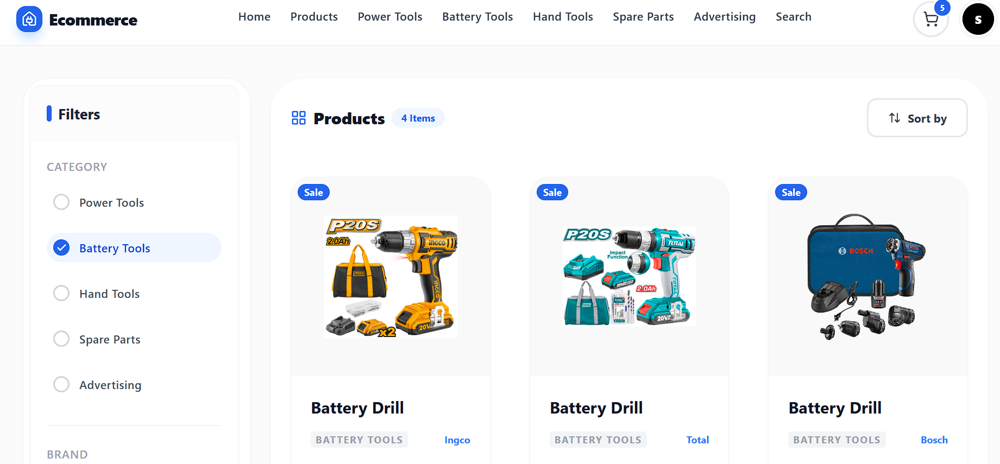

# 🛒 E-Commerce Power Store

This is a modern, high-performance e-commerce solution built with a focus on speed, scalability, and premium user experience. It combines a sleek storefront with a powerful data-driven dashboard.


_Replace this with a high-quality screenshot of your app to make your profile pop!_

## ⚡ What’s Under the Hood?

Most developers just build a UI; I focused on a complete flow. This project handles everything from dynamic product rendering to complex state management.

- **Blazing Fast Performance:** Powered by **Vite** for near-instant HMR and optimized production builds.
- **Adaptive Design:** Fully responsive UI crafted with **Tailwind CSS**, ensuring a perfect look on everything from an iPhone to a 4K monitor.
- **Centralized State:** Uses **Redux Toolkit** to handle cart logic and user data smoothly across the entire app.
- **Interactive Analytics:** A built-in dashboard that turns raw e-commerce data into visual charts and insights.

## 🛠️ Tech Stack

- **Core:** React.js (Vite)
- **Styling:** Tailwind CSS
- **State Management:** Redux Toolkit
- **Routing:** React Router Dom
- **Visuals:** Lucide Icons & Interactive Charts

## 🚀 Getting Started

Want to see it in action locally? Just follow these steps:

1. **Clone the repo:**
   ```bash
   git clone [https://github.com/codewithkamikaze/Ecom-client.git]
   ```
